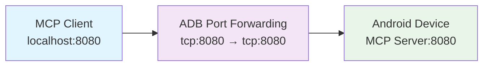

# ADB Port Forwarding

The Android MCP SDK provides comprehensive ADB port forwarding support to enable seamless
connectivity between MCP clients running on development workstations and Android applications
hosting MCP servers.

## Overview

ADB port forwarding allows you to connect MCP clients from your workstation to the MCP server
running on an Android device or emulator. This is essential for development workflows where you want
to use AI tools and MCP clients to interact with your Android application.

### How It Works



1. **Android MCP Server** runs on your device/emulator and exposes an HTTP/SSE endpoint on port 8080
2. **ADB Port Forwarding** creates a tunnel from `localhost:8080` on your workstation to port 8080
   on the device
3. **MCP Client** connects to `http://localhost:8080/mcp` and communicates with the Android app

## Quick Setup

### Prerequisites

- Android device or emulator connected via ADB
- Android app with MCP SDK integrated and running
- `adb` command available in your PATH

### 1. Setup Port Forwarding

The Android MCP SDK includes automated scripts for easy setup:

```bash
# Navigate to your project root
cd /path/to/your/android-project

# Setup port forwarding
./scripts/adb_testing/setup_port_forwarding.sh
```

This script will:

- ✅ Verify ADB is available
- ✅ Check device connectivity
- ✅ Setup port forwarding on port 8080
- ✅ Verify the connection is working

### 2. Launch Your Android App

Start your Android application that includes the MCP SDK. The server will automatically initialize
and start via AndroidX Startup.

### 3. Connect MCP Client

Connect your MCP client to the forwarded endpoint:

```bash
# Example with curl (for testing)
curl -X POST http://localhost:8080/mcp \
  -H "Content-Type: application/json" \
  -d '{"jsonrpc":"2.0","id":1,"method":"tools/list","params":{}}'

# Example response
{
  "jsonrpc": "2.0",
  "id": 1,
  "result": {
    "tools": [
      {"name": "device_info", "description": "Get Android device information"},
      {"name": "app_info", "description": "Get application information"},
      {"name": "system_time", "description": "Get current system time"}
    ]
  }
}
```

### 4. Cleanup

When done, clean up the port forwarding:

```bash
./scripts/adb_testing/cleanup_port_forwarding.sh
```

## Manual Setup

If you prefer manual setup or need custom configuration:

### Step 1: Check Device Connection

```bash
# List connected devices
adb devices

# Example output:
# List of devices attached
# emulator-5554    device
# RF8M802WXYZ      device
```

### Step 2: Setup Port Forwarding

```bash
# Forward port 8080 from localhost to device
adb forward tcp:8080 tcp:8080

# For specific device (if multiple devices)
adb -s emulator-5554 forward tcp:8080 tcp:8080
```

### Step 3: Verify Setup

```bash
# Check active port forwards
adb forward --list

# Example output:
# emulator-5554 tcp:8080 tcp:8080

# Test connectivity
curl -v http://localhost:8080/mcp
```

### Step 4: Cleanup

```bash
# Remove specific port forward
adb forward --remove tcp:8080

# Remove all port forwards
adb forward --remove-all
```

## Environment Variables

The setup scripts support environment variables for customization:

| Variable | Default | Description |
|----------|---------|-------------|
| `SSE_PORT` | `8080` | Port number for HTTP/SSE endpoint |
| `DEVICE_SERIAL` | (auto) | Specific device serial number |

### Examples

```bash
# Use custom port
SSE_PORT=8081 ./scripts/adb_testing/setup_port_forwarding.sh

# Target specific device
DEVICE_SERIAL=emulator-5554 ./scripts/adb_testing/setup_port_forwarding.sh

# Combine both
SSE_PORT=8081 DEVICE_SERIAL=RF8M802WXYZ ./scripts/adb_testing/setup_port_forwarding.sh
```

## Testing and Validation

The Android MCP SDK includes comprehensive test suites for validating ADB connectivity:

### Automated Tests

```bash
# Run all ADB tests
./gradlew :core:connectedAndroidTest --tests "*Adb*"

# Run specific test suites
./gradlew :core:connectedAndroidTest --tests "*AdbConnectionTest"
./gradlew :core:connectedAndroidTest --tests "*AdbPerformanceTest"
./gradlew :core:connectedAndroidTest --tests "*AdbReliabilityTest"
```

### Test Coverage

#### Connection Tests (`AdbConnectionTest`)

- ✅ Basic SSE endpoint connectivity
- ✅ MCP message exchange validation
- ✅ Port forwarding status verification

#### Performance Tests (`AdbPerformanceTest`)

- ✅ Latency measurement (target: <1000ms average)
- ✅ Concurrent connections (5+ clients)
- ✅ Sustained load testing (15+ seconds)

#### Reliability Tests (`AdbReliabilityTest`)

- ✅ Server restart recovery
- ✅ Multi-client reconnection
- ✅ Long-running stability (30+ seconds)

### Manual Testing

Test basic connectivity manually:

```bash
# Test server status
curl -v http://localhost:8080/mcp

# List available tools
curl -X POST http://localhost:8080/mcp \
  -H "Content-Type: application/json" \
  -d '{"jsonrpc":"2.0","id":1,"method":"tools/list","params":{}}'

# Get device information
curl -X POST http://localhost:8080/mcp \
  -H "Content-Type: application/json" \
  -d '{"jsonrpc":"2.0","id":2,"method":"tools/call","params":{"name":"device_info","arguments":{}}}'
```

## Troubleshooting

### Connection Refused

**Problem**: `curl: (7) Failed to connect to localhost port 8080: Connection refused`

**Solutions**:

1. **Verify device connection**:
   ```bash
   adb devices
   ```

2. **Check port forwarding**:
   ```bash
   adb forward --list
   ```

3. **Restart port forwarding**:
   ```bash
   ./scripts/adb_testing/cleanup_port_forwarding.sh
   ./scripts/adb_testing/setup_port_forwarding.sh
   ```

4. **Verify Android app is running** with MCP server started

### Multiple Devices

**Problem**: Multiple devices connected, unclear which one to use

**Solutions**:

1. **List available devices**:
   ```bash
   adb devices
   ```

2. **Use specific device**:
   ```bash
   DEVICE_SERIAL=your-device-serial ./scripts/adb_testing/setup_port_forwarding.sh
   ```

### Port Already in Use

**Problem**: Port 8080 is busy on your workstation

**Solutions**:

1. **Find what's using the port**:
   ```bash
   # macOS/Linux
   lsof -i :8080
   
   # Windows
   netstat -ano | findstr :8080
   ```

2. **Use different port**:
   ```bash
   SSE_PORT=8081 ./scripts/adb_testing/setup_port_forwarding.sh
   ```

3. **Update your MCP client** to connect to the new port

### Server Not Responding

**Problem**: Port forwarding works but server doesn't respond to MCP messages

**Solutions**:

1. **Check Android app logs**:
   ```bash
   adb logcat | grep MCP
   ```

2. **Verify server status** in your Android app UI

3. **Restart the Android app**

4. **Check for initialization errors** in the app logs

### Permission Issues

**Problem**: ADB access denied or permission errors

**Solutions**:

1. **Re-authorize device**:
   ```bash
   adb kill-server
   adb start-server
   adb devices
   ```

2. **Check USB debugging** is enabled on device

3. **Verify developer options** are enabled

## Advanced Configuration

### Custom Transport Configuration

You can customize the MCP server transport configuration in your Android app:

```kotlin
class MyApplication : Application() {
    override fun onCreate() {
        super.onCreate()
        
        // Get the MCP server manager
        val manager = McpStartup.getManager()
        
        // Check transport configuration
        val transportInfo = manager.getTransportInfo()
        Log.i("MyApp", "Transport info: $transportInfo")
        
        // Add custom tools for development
        manager.addSimpleTool(
            name = "debug_info",
            description = "Get debug information about the connection"
        ) { arguments ->
            """
            Debug Information:
            - Transport: ${transportInfo["transport_type"]}
            - Endpoint: ${transportInfo["sse_endpoint"]}
            - Running: ${transportInfo["is_running"]}
            - ADB Connected: ${checkAdbConnection()}
            """.trimIndent()
        }
    }
    
    private fun checkAdbConnection(): Boolean {
        // Check if ADB port forwarding is active
        return try {
            val socket = java.net.Socket()
            socket.connect(java.net.InetSocketAddress("localhost", 8080), 1000)
            socket.close()
            true
        } catch (e: Exception) {
            false
        }
    }
}
```

### CI/CD Integration

For automated testing in CI/CD pipelines:

```yaml
# GitHub Actions example
- name: Setup ADB Port Forwarding
  run: |
    ./scripts/adb_testing/setup_port_forwarding.sh
    
- name: Run ADB Connectivity Tests
  run: |
    ./gradlew :core:connectedAndroidTest --tests "*Adb*"
    
- name: Cleanup
  if: always()
  run: |
    ./scripts/adb_testing/cleanup_port_forwarding.sh
```

### Performance Monitoring

Monitor ADB connection performance:

```bash
# Run performance tests with detailed output
./gradlew :core:connectedAndroidTest \
  --tests "*AdbPerformanceTest" \
  --info

# Monitor network traffic
adb shell netstat -i

# Check port forwarding latency
time curl -s http://localhost:8080/mcp > /dev/null
```

## Integration Examples

### With MCP Client Libraries

=== "Python"

    ```python
    import asyncio
    from mcp import ClientSession, StdioServerParameters
    from mcp.client.stdio import stdio_client
    
    async def connect_to_android():
        # Connect to Android MCP server via ADB port forwarding
        server_params = StdioServerParameters(
            command="curl",
            args=["-X", "POST", "http://localhost:8080/mcp"]
        )
        
        async with stdio_client(server_params) as (read, write):
            async with ClientSession(read, write) as session:
                # Initialize the connection
                await session.initialize()
                
                # List available tools
                tools = await session.list_tools()
                print(f"Available tools: {[tool.name for tool in tools]}")
                
                # Call a tool
                result = await session.call_tool("device_info", {})
                print(f"Device info: {result.content}")
    
    # Run the client
    asyncio.run(connect_to_android())
    ```

=== "Node.js"

    ```javascript
    const { Client } = require('@modelcontextprotocol/sdk/client/index.js');
    const { SSEClientTransport } = require('@modelcontextprotocol/sdk/client/sse.js');
    
    async function connectToAndroid() {
        // Connect via ADB port forwarding
        const transport = new SSEClientTransport('http://localhost:8080/mcp');
        const client = new Client(
            { name: "android-client", version: "1.0.0" },
            { capabilities: {} }
        );
        
        await client.connect(transport);
        
        // List available tools
        const tools = await client.listTools();
        console.log('Available tools:', tools.tools.map(t => t.name));
        
        // Call a tool
        const result = await client.callTool({
            name: 'device_info',
            arguments: {}
        });
        console.log('Device info:', result.content);
        
        await client.close();
    }
    
    connectToAndroid().catch(console.error);
    ```

### With AI Development Tools

Many AI development tools can connect to MCP servers. Once ADB port forwarding is setup, configure
your tools to connect to `http://localhost:8080/mcp`.

## Security Considerations

!!! warning "Development Only"
ADB port forwarding should only be used in development environments. Never use this in production as
it exposes your MCP server to the local network.

### Best Practices

1. **Use only during development** - Never in production builds
2. **Restrict to localhost** - Port forwarding only binds to localhost by default
3. **Clean up connections** - Always run cleanup scripts when done
4. **Monitor access** - Check ADB logs for unexpected connections
5. **Secure MCP tools** - Ensure your MCP tools don't expose sensitive data

### Debug Build Protection

The Android MCP SDK includes built-in protection:

```kotlin
// The SDK automatically checks for debug builds
if (!BuildConfig.DEBUG) {
    throw IllegalStateException(
        "MCP Server is only available in debug builds for security"
    )
}
```

This prevents accidental inclusion in release builds.

## Next Steps

- **[Getting Started](getting-started.md)** - Initial SDK setup and integration
- **[Usage Guide](usage.md)** - Comprehensive SDK usage examples
- **[Transport Configuration](transport.md)** - Advanced transport setup
- **[API Reference](api-reference.md)** - Complete API documentation

For questions or issues with ADB port forwarding, see
the [troubleshooting section](#troubleshooting) or check the
project's [GitHub Issues](https://github.com/kaeawc/android-mcp-sdk/issues).