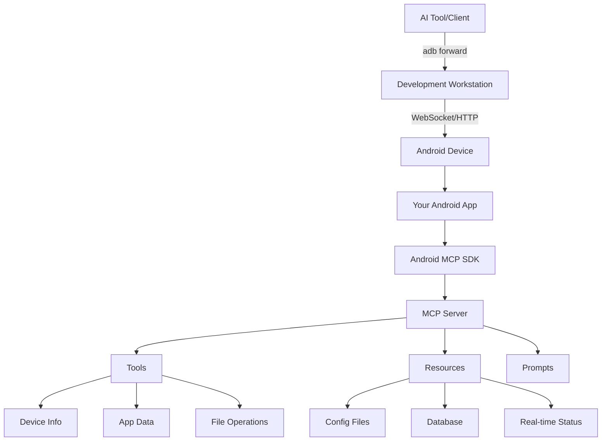

# Android MCP SDK

An Android library that integrates
the [MCP Kotlin SDK](https://github.com/modelcontextprotocol/kotlin-sdk) to enable Android
applications to host an MCP server.

## Overview

The Android MCP SDK provides a comprehensive solution for integrating Model Context Protocol
capabilities into Android applications. This enables your Android apps to expose tools, resources,
and prompts that can be accessed by AI tools and development environments via adb-connected
workstations.

## Key Features

- ✅ **Full MCP specification support** (tools, resources, prompts)
- ✅ **Built-in Android-specific tools** and resources
- ✅ **WebSocket and HTTP/SSE transport** layers
- ✅ **AndroidX Startup automatic initialization**
- ✅ **Thread-safe singleton management**
- ✅ **Comprehensive lifecycle management**

## Quick Start

Add the library to your Android project:

```kotlin
dependencies {
    implementation("dev.jasonpearson:mcp-android-sdk:1.0.0")
}
```

Initialize in your Application class:

```kotlin
class MyApplication : Application() {
    override fun onCreate() {
        super.onCreate()
        
        // MCP server is automatically initialized via AndroidX Startup
        if (McpStartup.isInitialized()) {
            val manager = McpStartup.getManager()
            manager.startServerAsync()
        }
    }
}
```

## What is MCP?

The Model Context Protocol (MCP) is an open standard that enables AI applications to securely
connect to and interact with local and remote resources. It provides a standardized way for AI tools
to:

- **Call functions** (tools) to perform actions
- **Access data** (resources) in various formats
- **Generate prompts** with dynamic templates

## Android Integration

This SDK brings MCP to Android by:

1. **Hosting MCP servers** within Android applications
2. **Exposing Android-specific capabilities** as MCP tools and resources
3. **Enabling remote access** via adb port forwarding
4. **Providing seamless integration** with existing Android development workflows

## Architecture



## Use Cases

### Development and Debugging

- **App introspection**: Expose app state and configuration to AI tools
- **Log analysis**: Provide structured access to application logs
- **Performance monitoring**: Real-time metrics and diagnostics
- **Configuration management**: Dynamic configuration updates

### AI-Assisted Development

- **Code generation**: Context-aware Android code generation
- **Test creation**: Automated test suite generation
- **Code review**: AI-powered code quality analysis
- **Documentation**: Generate documentation from code and usage patterns

### Data Access

- **Database queries**: Expose app database contents
- **File system**: Controlled access to app files and resources
- **Network data**: API responses and cached data
- **User preferences**: App settings and user data

## Transport Layers

The SDK supports multiple transport mechanisms for different use cases:

### WebSocket Transport (Port 8080)

- Real-time bidirectional communication
- Ideal for interactive AI tools
- Low latency for rapid tool execution

### HTTP/SSE Transport (Port 8081)

- HTTP request/response pattern
- Server-Sent Events for notifications
- Easy integration with web-based tools

## Built-in Capabilities

### Android Tools

- **Device Information**: Model, manufacturer, Android version
- **Application Info**: Package details, version, permissions
- **System Metrics**: Memory usage, battery status, system time
- **File Operations**: Secure file access within app boundaries

### Android Resources

- **App Configuration**: Settings and preferences
- **Device Status**: Real-time system information
- **Database Access**: Structured data exposure
- **File Resources**: Documents and media files

### Development Prompts

- **Log Analysis**: Automated log parsing and issue detection
- **Code Generation**: Android-specific code templates
- **Error Explanation**: Context-aware error resolution
- **Test Creation**: Comprehensive test suite generation

## Getting Started

Ready to integrate MCP into your Android app? Follow these guides:

1. **[Getting Started](getting-started.md)** - Installation and basic setup
2. **[Usage Guide](usage.md)** - Adding tools, resources, and prompts
3. **[Transport Configuration](transport.md)** - WebSocket and HTTP setup
4. **[API Reference](api-reference.md)** - Complete API documentation

## Project Goals

The Android MCP SDK enables Android developers to:

- **Bridge the gap** between AI tools and Android development
- **Expose app capabilities** through standardized protocols
- **Enhance development workflows** with AI assistance
- **Provide secure access** to app data and functionality

By implementing MCP in Android applications, developers can create powerful integrations with AI
tools, enabling more intelligent and context-aware development experiences.

## Community and Support

- **GitHub Repository**: [android-mcp-sdk](https://github.com/jasonpearson/android-mcp-sdk)
- **MCP Specification**: [modelcontextprotocol.io](https://modelcontextprotocol.io)
- **MCP Kotlin SDK**: [kotlin-sdk](https://github.com/modelcontextprotocol/kotlin-sdk)

## License

This project is licensed under the MIT License. See
the [LICENSE](https://github.com/jasonpearson/android-mcp-sdk/blob/main/LICENSE) file for details.